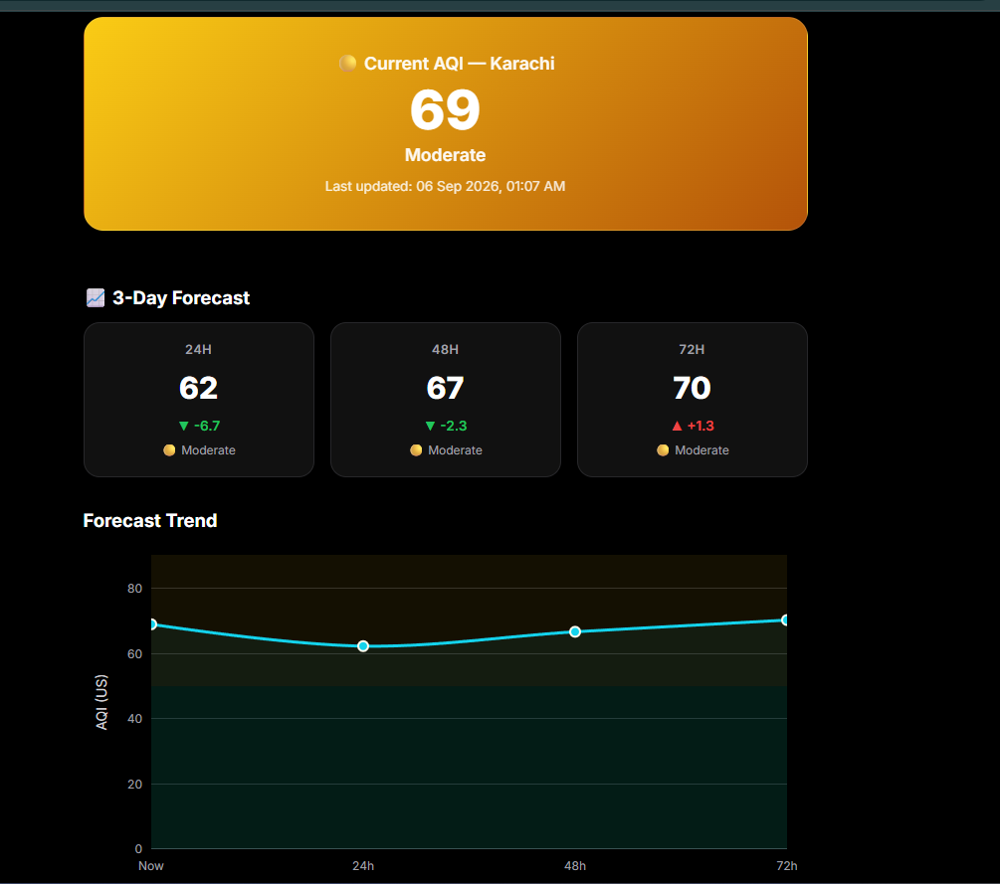

# Pearls AQI Predictor

Serverless end-to-end ML pipeline jo Karachi ki Air Quality Index (AQI) agle 3 din
(24h / 48h / 72h) ke liye predict karti hai.

🔗 **Live Dashboard:** https://aqipredictor-syjvh7kjnheplxy2w3pxgm.streamlit.app/
🔗 **GitHub Repo:** https://github.com/shafiaarif/AQI_Predictor
🔗 **Hopsworks Model Registry:** https://eu-west.cloud.hopsworks.ai/p/41176/models

## Dashboard Preview




## Architecture

```
[Open-Meteo Weather + Air Quality API]
        │
        ▼
feature_pipeline/fetch_data.py          -> raw weather + pollutant data
        │
        ▼
feature_pipeline/feature_engineering.py -> time-based + derived features (lags,
                                            rolling stats, AQI change rate, etc.)
        │
        ▼
feature_pipeline/preprocess.py, feature_Selection.py, validate_features.py
        │
        ▼
feature_pipeline/feature_Store.py       -> Hopsworks Feature Store
        │
        ▼
model_training/train_model.py           -> Random Forest, Ridge, XGBoost, CatBoost,
                                            Neural Network, CatBoost+NN Ensemble
                                            (5 feature sets: FS50/70/90/110/130)
        │
        ▼
register_model.py                       -> Hopsworks Model Registry
        │
        ▼
live_features.py                        -> merges local history + live Open-Meteo
                                            window into a real "right now" feature row
        │
        ▼
predict.py                              -> live inference (24h/48h/72h)
        │
        ▼
app.py (Streamlit)                      -> live dashboard + SHAP + alerts
```

Automation: GitHub Actions (`.github/workflows/`) — feature pipeline runs hourly,
training pipeline runs weekly (full retraining across 5 feature sets is heavy).

## Tech Stack

- Python, Scikit-learn, TensorFlow, CatBoost, XGBoost
- Hopsworks (Feature Store + Model Registry)
- GitHub Actions (CI/CD)
- Streamlit + Plotly (dashboard)
- SHAP (explainability)
- Open-Meteo Weather & Air Quality API

## Results Summary

Best feature set: **FS70**, Best model: **Ensemble (CatBoost + Neural Network)**

| Horizon | RMSE | MAE  | R²     |
|---------|------|------|--------|
| 24h     | 4.64 | 3.62 | 0.7252 |
| 48h     | 6.72 | 5.18 | 0.4499 |
| 72h     | 8.15 | 6.42 | 0.2274 |
| **Avg** | **6.50** | **5.07** | **0.4675** |

Baseline (persistence) comparison: avg RMSE 9.15, R² -0.063 — significantly better than model persistence baseline, especially for 48h/72h horizons.

## How to Run

```bash
# 1. Feature pipeline
python feature_pipeline/fetch_data.py
python feature_pipeline/feature_engineering.py
python feature_pipeline/preprocess.py
python feature_pipeline/validate_features.py

# 2. Training
python model_training/train_model.py
python register_model.py

# 3. Inference
python predict.py

# 4. Dashboard
streamlit run app.py
```

## Project Structure

```
AQI_Predictor/
├── data/
│   └── raw_dataset/
│       └── karachi_processed.csv       # full local history (used by live_features.py)
├── feature_pipeline/
│   ├── fetch_data.py
│   ├── feature_engineering.py
│   ├── feature_Selection.py
│   ├── feature_Store.py
│   ├── feature_view.py
│   ├── preprocess.py
│   ├── trim_future_rows.py
│   └── validate_features.py
├── model_training/
│   └── train_model.py
├── saved_models/
│   └── fs70/
│       ├── catboost/
│       ├── neural_network/
│       └── feature_columns.json
├── live_features.py                    # builds a real "right now" feature row
├── predict.py
├── register_model.py
├── app.py
├── requirements.txt                    # dashboard deps (Streamlit Cloud)
├── requirements-pipeline.txt           # feature/training pipeline deps (hopsworks)
├── runtime.txt
├── .streamlit/
│   └── config.toml
└── .github/workflows/
    ├── feature-pipeline.yml
    └── training-pipeline.yml
```

## Live Dashboard

https://aqipredictor-syjvh7kjnheplxy2w3pxgm.streamlit.app/